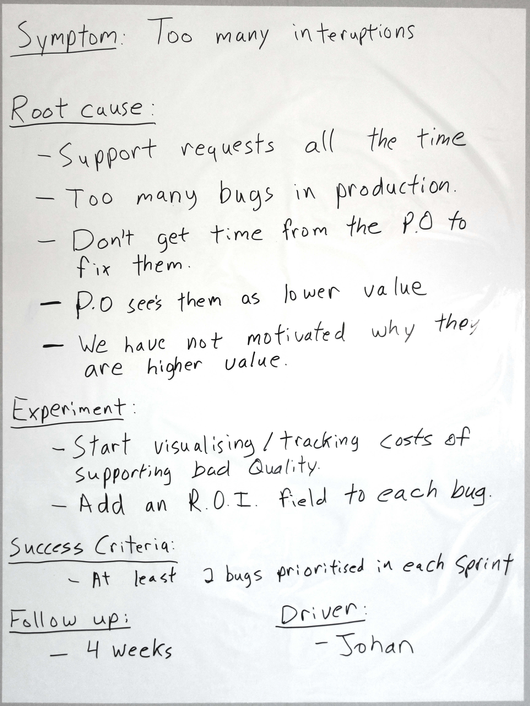

# Experiment Driven Change

The ability to continuously improve the way we work is central to all Agile teams and organisations. Most teams use Retrospectives or similar meetings, but far too often those meetings follow an unproductive pattern.

- Put a bunch of notes up on the board.
- Discuss them.
- Create a list of 10-15 problems.
- Agree those need to be improved.
- Give that list to the Scrum Master or mail them to a manager.
- Come back in a few weeks and **have the same discussion again**.

They do this for a few months or years until finally someone in the team has the courage to say "Why do we even do this? Nothing changes as a result."

If you are following this pattern, you are missing out on the value of Retrospectives. The most valuable thing about Retrospectives is the frequency at which we have them. This allows us to do things differently than we would in something like a project post mortem.

Consider moving to Experiment Driven Change.

## Focus
Since we are meeting with such frequency, we don’t have to treat this as our only opportunity to identify everything that is wrong in our organisation. Instead, we can focus on only one thing and try to have an impact on that. This has an important mental effect, because focusing on all the problems we have in the world is exhausting and overwhelming. By focusing on one thing, we start to feel like the issues are more manageable.

## Experiment
But the biggest upside to meeting so frequently to discuss improvements is the approach we can take to those improvements. We don’t need to find the perfect solution to the issue we are discussing, we don’t need to form committees and build consensus across our organisation. As a matter of fact, we don’t even need to know our solution will work at all.

Because we are working in such small increments, the only thing we need to come up with at a Retrospective is something to try out for the next few weeks: an experiment.

Because we are only going to try the experiment for a limited amount of time, any negative impact is controlled by the fact that when we meet again we will decide not to do it anymore.

And if it happens to make things better, well, now we are on our way!

The focus of a Retrospective is not to fix all our problems overnight; the only thing we are aiming for is to make the next few weeks slightly better than the ones before. Gradually as more of these experiments work we will start to feel their cumulative impact.

## Output

Here is a very simple model I use to attempt to arrive at usable experiments.

## Symptom
This is the “one thing” we have chosen to focus on. I always like to proceed from the premise that this thing is merely a symptom of an underlying issue.

You can arrive at this “one thing” in a variety of ways; you can look at any Retrospective format and it should provide a facility to arrive at this.  
  
A> **In the example:** Too many interruptions, a fairly common issue!

{pagebreak}

## Root Cause
Rather than simply launching into solution mode, we want to spend some time trying to arrive at what could actually be causing this, the root cause. Many tools exist for this portion of the discussion; in the example a tool called “5 Whys” was used. But the most important thing is that we are open, honest, and dig a bit deeper.

A> **In the example:** We realised that almost all of these interruptions were caused by needing to support bad quality in production. We then took the fairly common approach of blaming others “THEY won’t let us fix the quality!”. Eventually after more discussion we decided that we haven’t motivated very well why this is important.

## Experiment
This is where we decided upon specific actionable things that we would do to attempt to address this during the upcoming Sprint. In our experiments, while we would like it, we don’t need consensus from the whole group for the experiment. We merely need everyone to agree they are willing to try this out and see if it works.

A> **In the example:** We will be trying to put some numbers on the cost of these errors so that we can motivate their priority better.

## Success Criteria
How will we know this change has worked?

We don’t want to simply know that we have done it, that doesn’t insure it’s an actual improvement, just that we did what we said we would do. It’s nice to have something measurable here, but that doesn’t mean we need complex metrics, a measurement can be as simple as “80% of the team agree this was a successful experiment”.

A> **In the example:** Since we really want to fix some of these issues, we decided that the number of bugs prioritised was a good measurement.

## Follow up
How long will we try this before we evaluate its success?

## Driver
The driver is not responsible to do all the work themselves; they are responsible for reminding us as a team to live up to the commitments we have made to ourselves. It’s very easy to forget these things when our heads are back down in the code.

## Repeat
And that’s it!

Do I know this change will work?
No.

Do you know what won’t work?
Doing nothing…

## Tips
- Learn more about Retrospectives to make best use of this tool.
- Vary the method used to arrive at “the one thing” we focus on.
- Vary the tool used during the discussions of root causes.
- Timebox each part of this tool.
- Spend more time on root cause than actually devising the experiments, because that’s where all the value is.
- Use a Retrospective to focus specifically on this tool to see if there are any improvements you can make to it or your use of it.
- Never volunteer someone else to act as driver.
- Do not always have the Scrum Master act as the driver, teams need to feel responsible for their own improvement.

A> **Credit:** The specific in this are done by myself, but this concept has been around long enough I wouldn’t even hazard a guess at who invented it.
