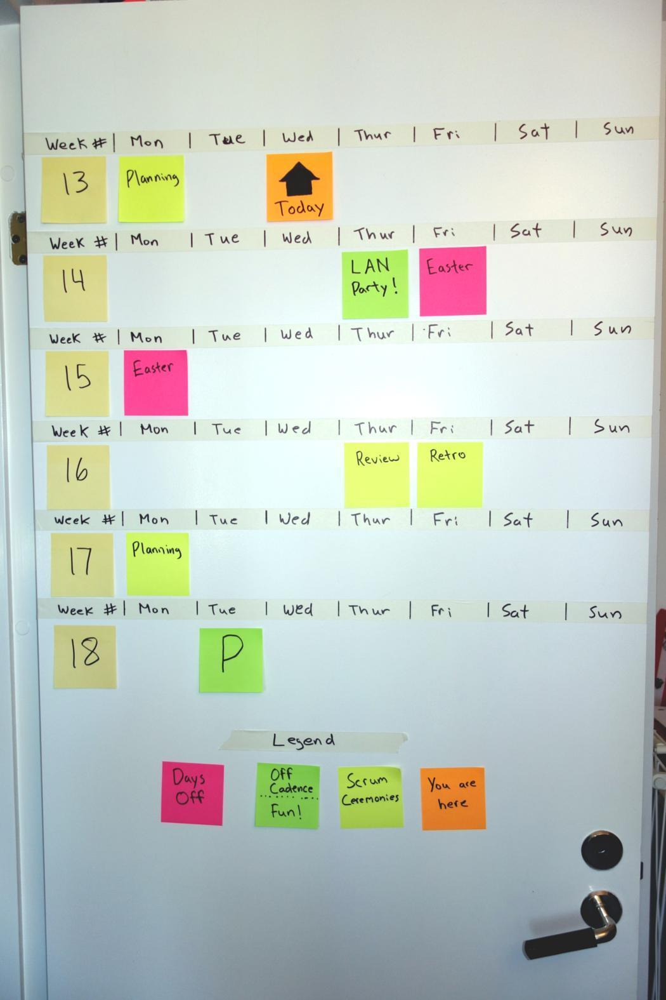

# Door Calendar

So named because it turns out the door is often a convenient place to put it, at least it has been for me three times.

Sometimes with your head down focusing on delivering value it can be easy to lose sight of what’s coming up. Or maybe you have certain events that happens at irregular intervals, such as holidays or company events. Or maybe the Sprint Review sneaks up on you every time!

This is where the Door Calendar comes in. 

The Door Calendar is a simple information radiator that helps you see when events are approaching so you’re not surprised by them. A picture really illustrates the concept best, so I’ll start with that.

The calendar is constructed using tape, a marker and Post-its.  
The top row includes days of the week.  
Each cell on the calendar is large enough to hold a Post-it note.  
These notes are added with some small text to indicate what the event is.  
Another note is used to indicate where today is.  
You can have week numbers (Swedes love week numbers) or dates along one side.  
During your daily meeting the today note is moved and new events are added.  
At the start of each week everything is moved up one row so we can see a bit further.  

Updating it as a team makes sure things don’t sneak up on anyone as they see the events approaching, but it also works brilliantly for starting discussions.

C> ***"Oh, is the customer putting that feature into production tomorrow?
Should we have some extra support available just in case?"***

C> ***"The big company party is coming in the next Sprint, we should be sure to plan a little less capacity for our next Sprint"***

## Tips
- Get in the habit of having everyone look when you move the today marker, it only takes a few seconds and adds a lot of value.
- Use different colour notes to indicate different types of activities like normal cadence meetings, holidays, one off’s, and more extra important events.
- Don’t be shy about putting fun things like outings and team events up there.
- Add dates to the week # column. 
- Don’t make it any more complicated than described here, it easily gets cumbersome to update.
  * The first version I created had laminated cards that could be reused and moved to indicate holidays, it was a pain and took WAY too much time for the initial setup.
- Keep the weekends on there, hopefully you never need them, but they also serve to break things up a bit and make it easier to look at.

A> **Credit:** I was part of the team that created this one. A brilliant team of consultants I worked with in Örebro, Sweden. You can find the company here: <http://www.Nethouse.se>
