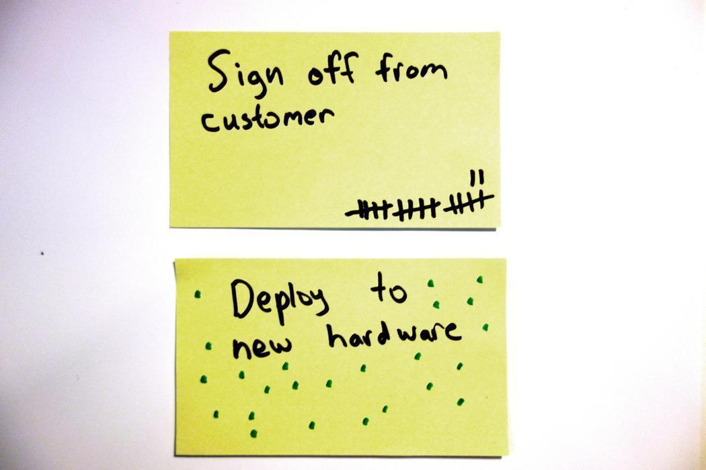

# Doing Dots

Partially done work is a tremendous source of waste in the IT industry. This partially done work usually takes the form of items that never move on your board. You know the ones, the Post-its you don’t even see anymore because they have been on the board long enough that your mental ad filter blocks them out.

These items are a much more serious issue than most people think, because they represent an investment that has not been realised. We have put time and energy into these items but we have not received the intended value from them as they have not been finished. Think about it, even if you put in very little time, just getting the note up on the wall required some planning, discussion, and labour. All these are a cost for value that has never been achieved.

These items are sometimes unimportant and should simply be thrown away, usually because they have been there so long the value has been lost. But more often than we would like these are items that have gotten blocked because of something which is not trivial to resolve. They are easily identified through conversation like:

C> ***"What’s up with task X?"***
C> ***"Well I sent an email and I’m still waiting to hear back"***

C> ***"Any movement on X?"***
C> ***"It’s sitting in department Y and you know how they are…"***

Or the worst one in my opinion:

C> ***"This one is basically done, I am just waiting for the OK from the customer before I move it"***

I had a team once that had a “customer approval” column on their board, which was absolutely covered in notes. When we decided to follow up these notes, it turned out most of the time the customer didn’t know they were being waited on. One of the customers had actually gone to another supplier because they got fed up with waiting!

By leaving items in a blocked status we are not addressing the underlying issues that allowed them to become blocked in the first place and creating the possibility for future items to become blocked because of the same root cause.

Doing Dots won’t actually fix this issue for you, but it will make it more visible and hopefully a bit harder to ignore.

Everyday that an item spends in a stage of our process it gets a dot or tick placed on it. Easy as that! Takes a few seconds everyday.

Eventually these items get absolutely covered in dots and we start asking questions of ourselves that we might never have asked otherwise:

C> ***"Is there anything we can do to get this moving again?"***

C> ***"Is this item actually valuable?"***

C> ***"How can we stop this from happening next time?"***

At the very least we will have to take notice of the item for the very brief time it requires to add the dot each day so we can’t just move it lower and lower until it eventually falls off and get’s thrown in the trash.

Work in process limits are also made to address this, but it’s possible to have this happen even with limits in place and simply flow around those items.

## Tips
- Tally up the dots to provide the cycle time of the whole process.
- Use a different colour for each stage, they can be tallied to provide a cumulative flow diagram.
- Visualise what the blocker is by using other symbols like “?” and “!”.
- Take items with the most ticks to your retrospective and try to find common causes, and of course ways to address them.

A> **Credit:** I learned this one from a video by a man named Paul Klipp (<http://www.paulklipp.com>).
