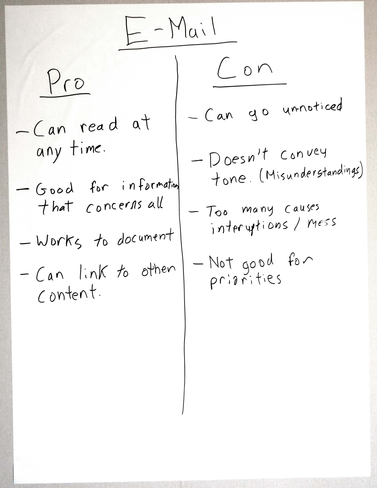

# Communication Protocol

Striking the right balance in communication can be very tricky. In Agile teams we value face to face communication because it’s high bandwidth and enables rapid feedback. But within a team communicating everything face to face can cause a lot of interruptions, and even tension to break out in the teams.

If you feel you are having trouble striking the right balance, try getting a Communication Protocol in place.

A Retrospective is a great facility for this.

Start with an introduction, explain to the team that you will talk about how and why you communicate, and to decide on your rules of communication. 

Remind everyone that all decisions are experiments, so no one needs to feel like they will be locked in by a decision they don’t agree with. We will simply bring it up again and try something else if someone can’t live with a decision long term.

I like to have a quick round table about how people feel communication is working within the team. This helps everyone open up, and gives us an idea if there is a problem and where it might be.

Next an open brainstorming session about in what circumstances people need to communicate with one another. I just ask people to shout out suggestions, I write them down on individual Post-its and put them up on the whiteboard. This further encourages open discussion, and allows team members to build off each others ideas.

Now we have a list of reasons to communicate, now we need to see how we communicate. Have the team discuss and list as a group the different facilities we have for communication. Some common examples are:

- Face to face
- Daily standup
- Team chat   
- Email
- Issue tracker
- The board
- Planning
- The Retrospective
- The Review

Then have a brief discussion about the benefits and drawbacks of each of these, write them down separately for future reference.

Use each facility that comes up here as a heading on the whiteboard and ask everyone to start grouping the different circumstances of communication under them. When there is disagreement have a discussion surrounding it. If it can be resolved quickly, great. If not, move them to a “parking lot” until the end of the meeting.

Once you have group all the ones people can agree on, move on to the ones that were not trivial to resolve. Allow a short timebox to discuss each one, but if in the end agreement can’t be reached, use a simple voting system (fist of five or dot voting) to decide the initial state and mark that item as disputed. This will make people who didn’t get their way to feel a bit better, and make sure you follow up how well the solution is working.

You now have a Communication Protocol!  
You’ll probably want to transfer it to the team room in some way.

The true value of this is in the discussions it spawns, not the actual output. Things like:

C> ***"I really hate when I get interrupted by testing questions?"***

C> ***"But don’t you think it’s important to test the things we build?"***
  

C> ***"Sometimes I feel awkward interrupting people, because I am so new and need to do it so often"***

C> ***"On boarding new people is very important to us, we don’t mind if you interrupt us at all! Also, we should probably be pairing with you more"***

## Tips
- If you don’t have a team chat as an option, get one, they fill that place between face to face and email very well.
- Rephrasing the output into a series of questions and answers makes it easier for new team members to understand.
- When in doubt, choose face to face, it’s always the safest option.
- In groups that are quiet, or have extremely dominant personalities, have people list the circumstances as an individual activity.

A> **Credit:** The specific in this are done by myself, but this concept is advocated by many people, I wouldn’t even hazard a guess at who invented it.
