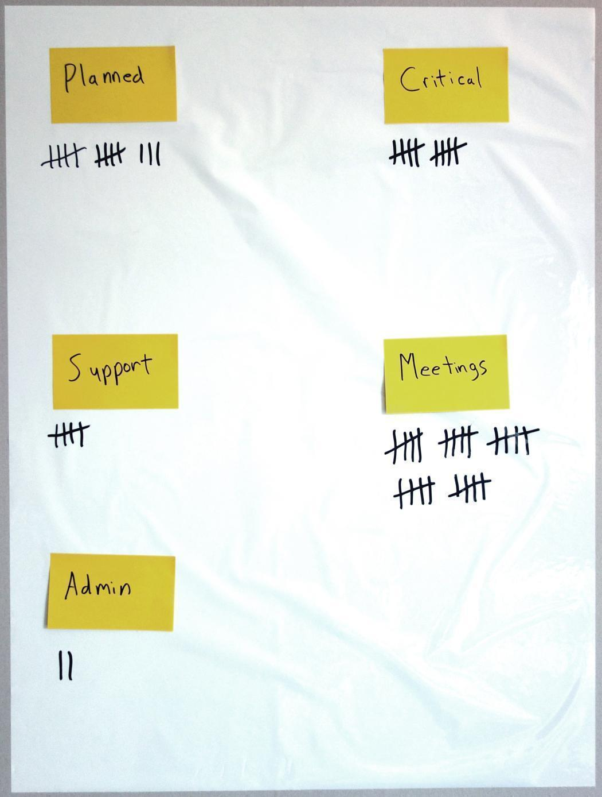

# Where Does The Time Go?

Does it feel like you never have any time to focus?
Do you feel like time is just disappearing and you don’t know to where?
Are you sure there are too many meetings but can’t convince others?
Do you spend more time than you feel you should on wasteful activities?

Then you should start figuring out Where Does The Time Go?

It’s very important in creative activities, such as software development, that we get large chunks of uninterrupted time. This enables us to get into a flow and really be productive and innovative. But far too often we find we only get an hour or two here and there.

When trying to motivate why something has to change it’s always good to bring data. This simple tracking system can help you do that.

First, decide on a few different categories for time. Here are some that I like to use, but you should decide on these with your team.

- Planned
  * The work you had planned to accomplish.
- Support
  * Cost of poor quality or usability.
- Critical
  * Unplanned work that was deemed to be critical.
- Meetings
  * Time spent in meetings.
- Administration
  * Things like creating reports, time reporting, etc.

Don’t bother clearly defining exactly what each is used for from the start. You can solve these questions as they come up.

At the daily meeting take a moment for each team member to tick the categories they worked on the previous day. The numbers don’t need to be precise, just close enough.

Compile the numbers every so often and wipe the chart clean.

You will now have data to motivate the things that you feel are wasteful, and you might even discover time is being spent in ways you never even suspected.

## Tips
- Take this along to retrospectives to discuss value adding and non value adding activities.
- Make it very clear to the team this is not a time tracking tool.
- Use Post-its for the categories so they can be added or removed.
- If there is something specific you want to remember you can add a Post-it under the category to remind you of it when the retrospective rolls around.
- Track the data over periods of time to see trends.

A> **Credit:** As far as I am aware, this one is all me.
