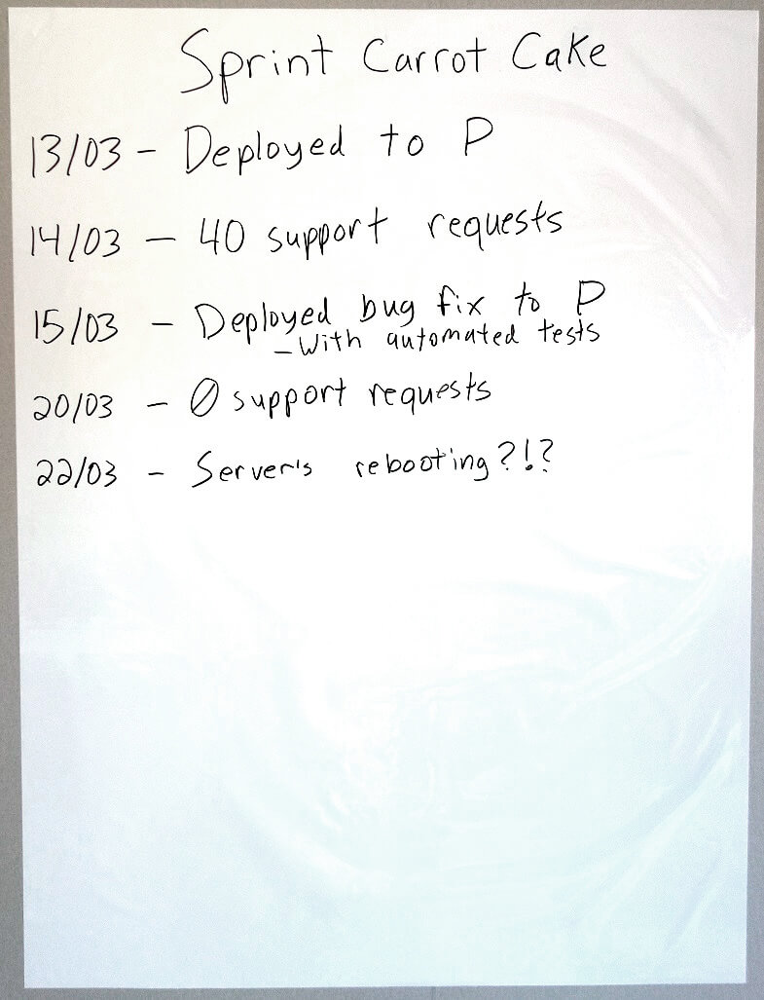

# Event Log

Do you get into your retrospectives and the team finds they only really remember the last few days? Do you find that important events do not always get brought up at the retrospective?

A simple tool I call the Event Log can help with this.

All you need is to mount a large piece of paper (A1) near your Sprint or Kanban board. I personally like these: <http://www.magicwhiteboard.co.uk/>

Each day at your daily meeting you take a moment to write down things from the previous day that people feel are important to remember.

This can then be brought along to the retrospective either as is, or compiled into a timeline. It only takes a few seconds for people to glance at it and be reminded of events from the previous iteration they may otherwise have forgotten to bring up. 

Also, the act of reflecting everyday in and of itself provides benefit because we take time to focus on the previous day before we move onto the next one!

## Tips
- Update this as part of a daily ritual. Everytime I tried to use “update it whenever you think of something” it has not been successful.
- You can also use it to quickly gather other data such as:
  * Team happiness
  * Confidence in the plan
  * Amount of quality issues
  * Don’t do too much of this at once, you don’t want it to become a chore.
- Encourage putting successes up there as well. It’s very easy for this to simply be a list of “issues” from the week.
- You can use it to define a focus for the retrospectives as well, by simply dot voting on the events.

A> **Credit:** I was part of the team that created this one. A brilliant team of consultants I worked with in Örebro, Sweden. You can find the company here: <http://www.Nethouse.se>
