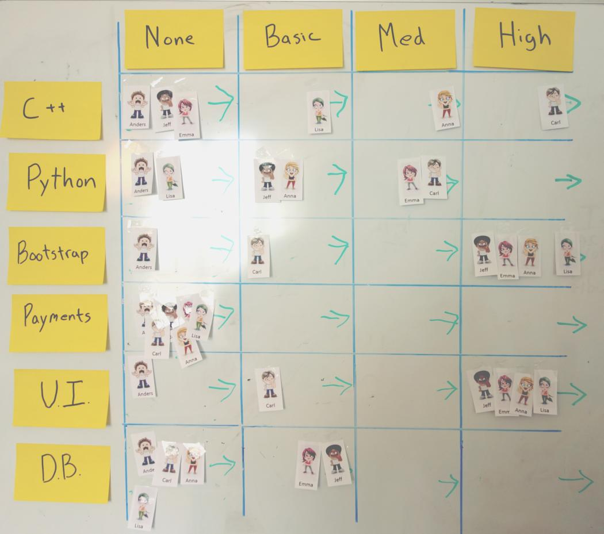

# Resilience Map

We often talk about working in Cross-functional teams in Agile, and T-Shaped people. There are a lot of benefits with this approach. We are much less likely to become bottlenecked by a particular competence, having teams take things from idea to deliver results in less handover, and we are a lot more resilient to unexpected event. Team members will always come and go, and single ownership of a competence is a huge risk for any team.

But how do we go about reducing this risk?  
What do we focus on first?

Do you notice in planning that you need to take something lower priority because there is not enough of one type of competence?  
Do you often find yourself saying “That’s a typical Sebastian task”?  
Do you worry that if one person leaves you will not be able to manage a specific system?

Maybe you should try out a Resilience Map.

This is one of those cases where a picture says a thousand words:

It’s a fairly simple information radiator created by the team. Along the Y axis we have the technical competences or areas of our product, and along the X axis we have the level of comfort in that area. Then we have avatars representing each team member. We also have an area to the right of each box that shows if we are focusing on learning in that area or not.

At a glance I can see:

- We have a very serious issue in the payment area of our product, we had better start focusing on doing something about that. 
- In the UI and related technologies we have a lot of resilience so, maybe not such a high priority.
- Anders is in a lot of trouble, he doesn’t feel confident in any of these areas.
Which areas we are currently trying to address.
- Who I’d best speak to if I don’t feel comfortable in a certain area.

The Resilience Map won’t actually make us any better in our resilience, but it will make it very obvious that there is a problem. This is the first step in addressing any problem.

There are many different uses for this, listed in the tips.

## Tips
- Take this along to retrospectives to shine a light on these issues.
- Take this along to planning sessions so you are able to consider what gaps you have and the possible effect of them.
- Use this to motivate to your Product Owner or stakeholders why something is a higher priority than they think.
- Use this daily when pairing up.
- Don’t put everything up there, it will become too much to read and maintain, focus only on the highest priority stuff.
- Choose a regular interval at which to update this, not just the avatars but the focus areas along the Y axis.
- Consider if your organisation is ready for this level of openness, if anyone in the team is nervous about the reaction, keep it as a private tool for the time being.

A> **Credit:** As far as I am aware, this one is all me.
