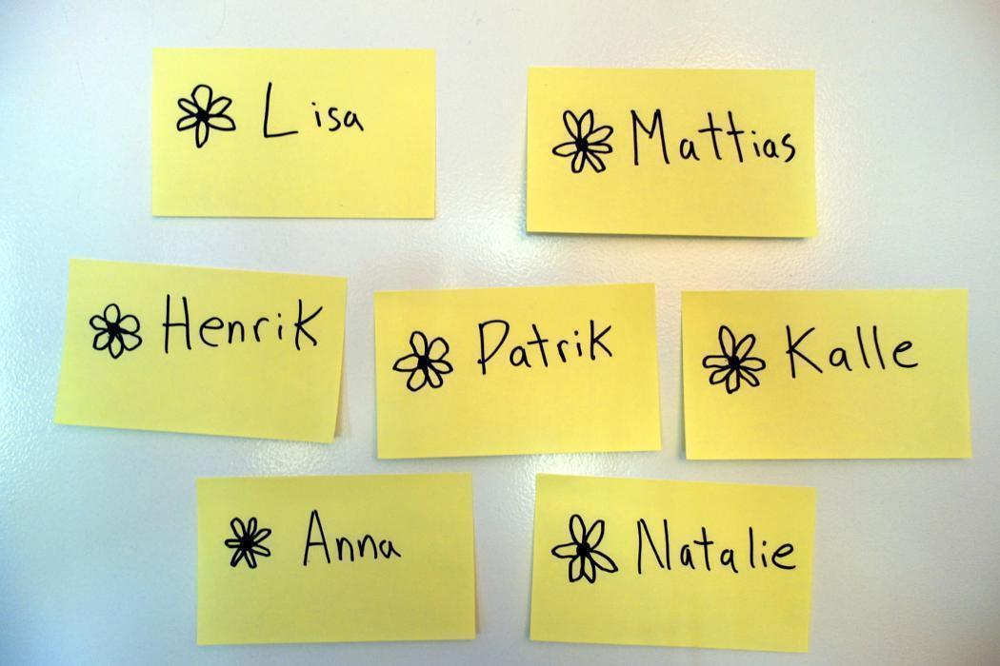

# Appreciation Flowers

It feels nice to be appreciated.  
It feels nice to know that your co-workers notice the little things you do.  
It feels nice to get a pat on the back when you have done a particularly good job.

That’s what Appreciation Flowers are all about; making people feel nice!

At your retrospective, have a section on the wall where people can post flowers to one another.  A flower can be as simple as a Post-it with a person’s name on it, although I like to make them a nice drawing of a flower as well.

These flowers are used to say a special thank you to someone.

Dedicate a few minutes to take up each note individually and the person who wrote it says a few words about why they wrote it.

The recipient is given the flower to take back to their desk, or wherever they like.

Generally, after a while a bit of an arms race develops around the flowers and people start drawing more and more elaborate things on them in an effort to make their gift extra special.

## Tips
- Give flowers to people outside the team as well. They always appreciate receiving them.
- Use the number of flowers given as an indicator of the mood in the team.

{pagebreak}

A> **Credit:** There are many people who advocate this. The one that springs to mind is Jurgen Appelo and his "Kudo Box". But this was created by a brilliant team of consultants I worked with in Örebro, Sweden. You can find the company here: <http://www.Nethouse.se>
