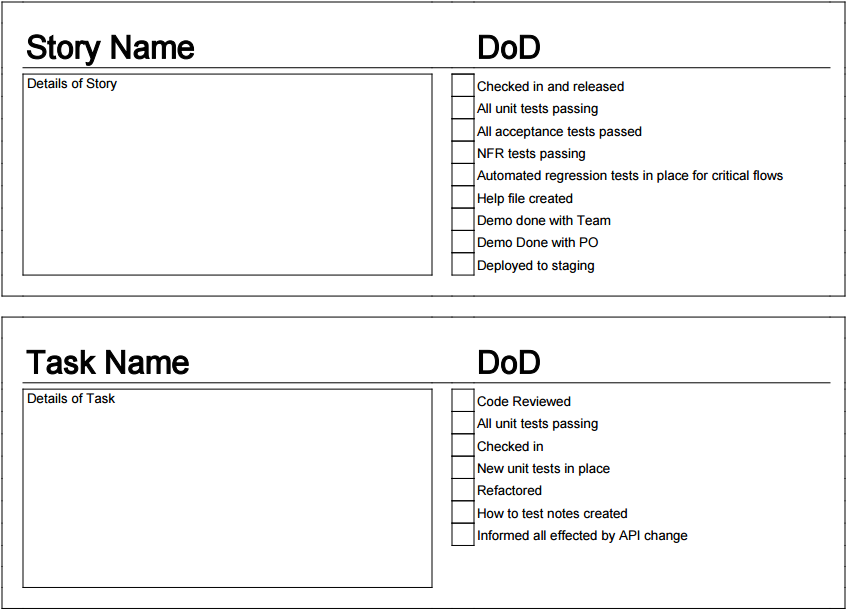

# In-Line Definition of Done

This tool assumes you are familiar with the Scrum tool “Definition of Done”, if not, take a glance at it first.

Are you following your Definition of Done?
Do you know what it contains?
Are you often forgetting the small things you need to do when building your product?
Is your current process prone to human error?

If so, you might consider using an In-Line Definition of Done to make it more prominent in your mind.

Definition of Done not only keeps us honest in our teams, prevents us from cutting corners whenever we like, but it also serves as a reminder of how our process works so that the small stuff is not forgotten.

Most teams have this posted prominently over the “Done” column of their board, but you would be surprised how this is easily ignored, especially in crunch time. If this is what is happening to you, try this:

- Break your Definition of Done into a short checklist.
- Make a template for the tasks and stories that you use of your board.
- Make a ceremony out of checking off every item before tasks and stories move to done of the board.

Simple as that!  
Your Definition of Done is now harder to ignore.

## Tips
- Sometimes the checklist won’t make sense for every single item, get in the habit of crossing out the ones that don’t fit. This will make sure it’s an active decision to ignore them.
 - If this happens too often with an item, consider removing it.
- Take these items to your Retrospective and ask the question “What can we automate from this list?”.

A> **Credit:** I was part of the team that created this one. A brilliant team of consultants I worked with in Örebro, Sweden. You can find the company here: <http://www.Nethouse.se>
