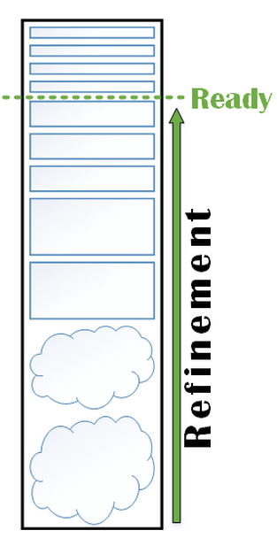

# Not Now Backlog

Maintaining a Product Backlog can be a costly activity, and it gets more and more costly the larger the backlog becomes. Actually, the cost is not the worst part of having a large backlog, the real risk is that it will become so unruly that it won’t be used to its potential.

A useful backlog looks a bit like this:

At each “level” of the backlog we have just enough information to enable us to do what we need to do next, and do it well. A useful backlog provides transparency to our entire organisation about what we are working on now, what is coming next, what will happen in the future. It also provides the information on what is ready to be actioned immediately, and what requires more investigation or elaboration before it can be actioned.

A useful backlog is an immensely valuable tool, which enables us to make the best decisions possible, and take the right actions at the right time.

Keeping a backlog in a useful state is a very hard job. In Scrum for instance, we have a role whose primary responsibility is working on the state of the backlog, and even in Scrum this is often not enough. That’s because maintaining, understanding, and harnessing the backlog requires a contribution from all the stakeholders involved.

An unruly backlog is expensive in a lot of ways.

So, the solution is simple right? Throw stuff away that you don’t need!  
If you are doing this, great for you, stop reading now.

But if you find your backlog is hard to maintain, it is a place where requests go to die, and people are always resistant to throwing things away, the Not Now Backlog might just be the tool for you.

I will never quite understand peoples resistance to throwing items away. I am of the opinion that if something is important it will come back, and that if we haven’t used something in the last two years it’s highly unlikely we will be using it ever. But I get surprisingly little support for this way of thinking - people worry about traceability, and that some piece of vital information may be lost. So, to soothe those fears we have the Not Now Backlog.

First, you need to decide what now means to your organisation. This can be a tricky question to answer, but I generally ask myself and my stakeholders a few questions:

- How far into the future can we reliably predict our priorities?
- How far into the future do we need to predict our priorities?
- How often do our priorities change drastically?
- How many items can we commit to maintaining?
- How much are we willing to spend on backlog maintenance?

This results in a lot of discussion, but in the end what need to to arrive at is something like “we want to be able to see as far as X months/weeks/days into the future”.

After that it’s very simple, we go through our huge unruly backlog and ask ourselves “Do we realistically think this will be a priority within the next X months/weeks/days?”.

Everything that is a “No” goes into the Not Now Backlog.

Congratulations, you can now start focusing on bringing value to the backlog you have.

“But now we need to maintain that backlog too!” I hear you cry. The only thing I can say about that is, I never have. In all the times I have used this tool, I have never again needed the items that were put in there, they simply went there to die. But luckily we saved them just in case ;-)

In case I have not made it clear, this is a tool I think we should be able to do without, it is a suboptimal solution to what I consider a larger problem. But, maybe it’s a necessary first step.

## Tips
- If you are having trouble finding the now interval, just start with 6 months.
- Do not put things here that you know you’re never going to do, if you can get everyone to agree it will never be done, throw it away.
- Try setting a work in progress limit instead of a time interval and simply say, the backlog never contains more than X items.
- Use this in environments where traceability is mandated by law or regulation.

A> **Credit:** This was originally created by a great friend and former co-worker of mine Christoffer Valgren: <https://retrospektivet.wordpress.com/>. I think it was a response to my constant advocacy that we throw things away.
A>
A> Also, his original Swedish name for it is much better “glömskalista”.
