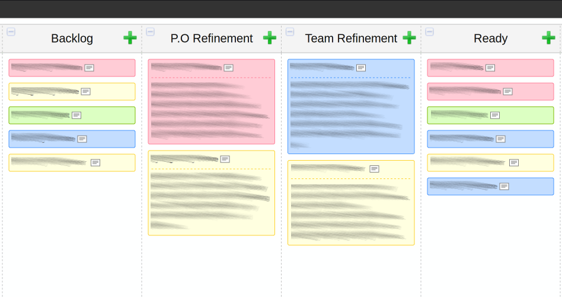
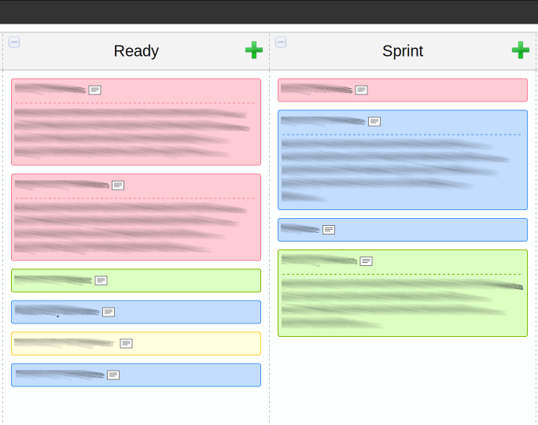
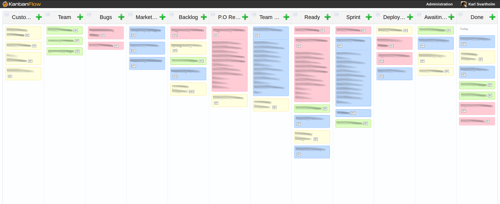

# Visualised Flow

There is nothing more crucial to the success of a product than successful collaboration, at least that what we believe in the Agile world. Collaboration is hard in any context, but it’s basically impossible when people are discussing different things.

Are you having Sprint Planning meetings that are long, hot, boring, it smells bad in the room, and in the end everyone agrees to a Sprint just to get out of the room?

If the answer is yes, then Visualised Flow will likely help you a lot.

Do your stakeholders know what you’re working on at this moment?  
Do they know what you are going to work on next?  
Do they know if the things you have just finished are actually in production or not?  
Do they know what actions they need to take to get their items to the front of the queue?

If the answer is no, then Visualised Flow will likely help you a lot.

This is one of the most steadfast and valuable tools in my toolkit. It is usually one of the first things I look for when I enter an organisation and one of my first objectives if it doesn’t exist.

Not only can visualising this process increase transparency throughout your organisation, but it is built to facilitate and support collaboration across your organisations.

The goal is to have a visualisation of how value flows through you organisation, from the moment something is requested to the moment that is arrives at the intended recipient. So that anyone in your organisation can glance at this tool and know what the status of an item is.

## Find the In-Flows

First I start out by trying to figure out where requests for work come from. Items don’t just magically appear in the backlog, they originate from somewhere, whether this is particular stakeholders, or different products will depend on your context. Some common examples shown below.

This allows our stakeholders to prioritise as individuals, to consider what is most important to them, but eventually everything gets moved into the backlog area where we need to make decisions about how we will balance the conflicting priorities. This helps to facilitate those discussions, because it is impossible to ignore the priorities of other, they are right there in your face.

So we end up with a list of items that has been prioritised against one another, but these items are very rarely in a state where we can simply pull them and start working.

## Refinement

Usually some form of elaboration is required before items are actually ready to be worked on. Most people refer to this as refinement or grooming of the backlog. If you have a specific process in place for this you can visualise it, if not here is a very simple starting point.

In this example we have items under investigation from the Product Owner and items that need investigation from the team, both can easily see things that are awaiting action from them. Your process may be much more elaborate than this, maybe you require a customer sign off, or UI mockups, or you have a prototyping phase. Regardless of what your process looks like, the objective here is to reach a state of “Ready” where items can simply be pulled from there into implementation.

How “Ready” is defined will vary from organisation to organisation, I highly recommend you consider a formal “Definition of Ready” for this stage, but if you don’t have that yet a simple starting point is “all the team members agree we could work on this tomorrow”.

This is the state most people think of when they think of a backlog, “Ready”, really this is the top of the backlog where items can simply be pulled.

## Implementation

From the team’s perspective things are now much easier, we have a prioritised list that is defined to the level of detail that we require to actually work on it. We simple start pulling things into the implementation stage, maybe this is a Sprint if we are using Scrum, or simply In Process if we are using Kanban.

## The Outflow

If you are practising continuous deployment or releasing to production at the end of each Sprint, then you can likely skip this step. Ideally we all want to be in the situation that “Done” on the teams board means completely done, as in delivered to a customer who is happy with it, but not all teams are in that state yet.

If you are not yet at this stage, you need to also visualise what happens after items are done by the teams, and before they are actually delivered.

In this example we have a “Deployment Test” phase, and then we hand over to the deployment team so we have a waiting area for that. This helps a lot in this example because people start to ask questions like:

C> *"Why are there so many items in awaiting deployment?"*

C> *"Well, if you recall we have this deployment team we need to hand over to because we don’t have direct control over the servers, if we had that we could move these waiting items much faster"*

Regardless of what it looks like for you, you need to make each stage clear so that if items are not actually in production, everyone in your organisation can see that.

## Seeing The Whole

Put it all together and and what do you get? You can a view of the entire process flow of your organisation, and the ability to make more informed decisions and have collaborations where everyone is discussing the same thing.

## Abstraction

A side benefit of this system is it allows abstraction where needed. Probably the development team has a team board that carries more specifics about each items breakdown and progress, but our entire organisation doesn’t need this information. It would merely confuse them to have that level of detail, thereby reducing our transparency.

Never confuse visibility with transparency, information can be highly visible but if the person seeing it can’t interpret it, it’s not transparent.

The same of course goes for all stages here, maybe the Product Owner has a defined refinement process, maybe the deployment team does, all of that is visualised to appropriate detail here.

## People and Interactions over Processes and Tools

It is very possible to setup this entire system and have no positive effect at all from it, because this is a tool to facilitate conversations - not replace it. People understand how this works because they are involved in how it’s created and used, they are present when their items are moved and elaborated. If you are using this as a way to not speak to each other then it won’t work.

## Tips
- Use different colours to illustrate different inflows so they can easily be tracked throughout the process.
- If more detail is available for a specific stage, for example a teams Scrum board, include where that information can be found in this flow.
- Value ease of use over functionality when choosing a tool to do this, I use <http://www.kanbanflow.com>
- If you don’t know your process today, start simple and add the missing steps as you discover them.

A> **Credit:** The specific in this are done by myself, I have been iterating the design over many years and products, but process visualisation has been around long enough I wouldn’t even hazard a guess at who invented it.
